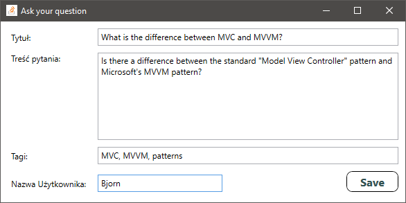

# StackOverflow Client - WPF Application

This is a C# solution for testing new ideas, features and frameworks etc.
Solution is based on desktop WPF + MVVM application with Unity container used to manage all tested dependencies.
This approach allows you to replace components with another one that implements the same interface.

# Screenshots:
### Main window:

 

### New question window:

 

# Technologies used:
- WPF with MVVM pattern
- Unity DI Container
- Entity Framework
- SQLite
- NLog
- NUnit with Moq

